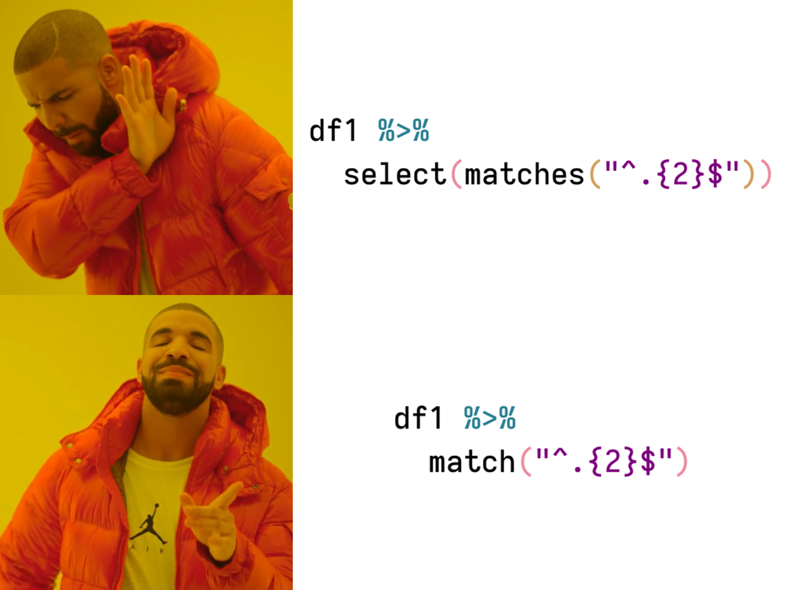

<!-- README.md is generated from README.Rmd. Please edit that file -->

```{r, include = FALSE}
knitr::opts_chunk$set(
  collapse = TRUE,
  comment = "#>",
  fig.path = "man/figures/README-",
  out.width = "100%"
)
```
# quickselect 

<!-- badges: start -->
[](https://travis-ci.com/camkay/quickselect)
[](https://ci.appveyor.com/project/camkay/quickselect/branch/main)
[](https://codecov.io/gh/camkay/quickselect?branch=main)
[](https://www.tidyverse.org/lifecycle/#stable)
<!-- badges: end -->

Quickly select columns from a data frame or tibble using [regex](https://en.wikipedia.org/wiki/Regular_expression). It is essentially a wrapper for `select(matches("my_var"))` from `{dyplr}` and `{tidyselect}`. It includes two functions `match()` and `unmatch()` 

<p align="center">

</p>

## Installation

The development version of `quickselect` can be installed from [GitHub](https://github.com/) with:

``` r
# install.packages("devtools")
devtools::install_github("camkay/quickselect")
```

## Descriptions and Examples

```{r setup, include = FALSE}
# load quickselect
library(quickselect)
library(dplyr)

# suppress scientific notation
options(scipen = 999)

# create example data
data_example <- data.frame(group  = c("A", "A", "B", "B", "A"),
                           mach   = c(NA, 2, 300, 200, 3),
                           narc   = c(2, 4, 500, 700, 10),
                           psyc   = c(3, 4, 1800, 2000, 5),
                           des    = c(100, 100, 2, 10, 1000),
                           mor    = c(10, 10, 500, 1000, 20))
```

### match

`match` extracts columns in a data frame that match a specified [regex](https://en.wikipedia.org/wiki/Regular_expression) string.

```{r match_example}
# look at example data
data_example

# match columns that start with m
data_example %>%
  match("^m")
```

### unmatch

`unmatch` extracts columns in a data frame that DO NOT match a specified [regex](https://en.wikipedia.org/wiki/Regular_expression) string.

```{r unmatch_example}
# look at example data
data_example

# return columns that do not start with m
data_example %>%
  unmatch("^m")
```
